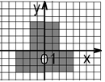

#### Line
1. [Найдите  значение функции: z = ( (a – 3 ) * b / 2) + c.](../../com.epam.learn.jbupskill.lab/src/module1/line/task1.java)
2. [Вычислить значение выражения по формуле (все переменные принимают действительное значение): ((b+√b²+4ac)/2a)-a³c+b²](../../com.epam.learn.jbupskill.lab/src/module1/line/task2.java)
3. [Вычислить значение выражения по формуле (все переменные принимают действительное значение): sinx+cosy/cosx-siny*tgxy.](../../com.epam.learn.jbupskill.lab/src/module1/line/task3.java)
4. [Дано действительное число R вида nnn.ddd (три цифровых разряда в дробной и целой частях. Поменять местами дробную и целую части числа и вывести полученное значение числа.](../../com.epam.learn.jbupskill.lab/src/module1/line/task4.java)
5. [Дано натуральное число Т, которое представляет длительность прошедшего времени в секундах. Вывести данное значение длительности в часах, минутах и секундах в следующей форме: ННч ММмин SSc.](../../com.epam.learn.jbupskill.lab/src/module1/line/task5.java)
6. [Для данной области составить линейную программу, которая печатает true, если точка с координатами (х, у) принадлежит закрашенной области, и false — в противном случае: 
   ](../../com.epam.learn.jbupskill.lab/src/module1/line/task6.java)

#### Branching
1. [Даны два угла треугольника (в градусах).Определить, существует ли такой треугольник, и если да, то будет ли он прямогульным.](../../com.epam.learn.jbupskill.lab/src/module1/branchig/task1.java)
2. [Найти max{min(a,b),min(c,d)}](../../com.epam.learn.jbupskill.lab/src/module1/branchig/task2.java)
3. [Даны три точки A(x1,y1), B(x2,y2),C(x3,y3). Определить будут ли они на одной прямой.](../../com.epam.learn.jbupskill.lab/src/module1/branchig/task3.java)
4. [Заданы размеры A,B прямоугольного отверстия и размеры x,y,z кирпича. Определить, пройдет ли кирпич через отверстие.](../../com.epam.learn.jbupskill.lab/src/module1/branchig/task4.java)
5. [Вычислить значение функции: x2-3x + 9, если x<=3; 1/x3 + 6, если x>3](../../com.epam.learn.jbupskill.lab/src/module1/branchig/task5.java)

#### Cycles
1. [Напишите программу, где пользователь вводит любое целое положительное число. А программа суммирует все числа от 1 до введенного пользователем числа.](../../com.epam.learn.jbupskill.lab/src/module1/cycles/task1.java)
2. [Вычислите значения функции на отрезке [a,b] с шагом h: y = x,x>2 -x,x<=2](../../com.epam.learn.jbupskill.lab/src/module1/cycles/task2.java)
3. [Найти сумму квадратов первых ста чисел](../../com.epam.learn.jbupskill.lab/src/module1/cycles/task3.java)
4. [Составить программу нахождения произведения квадратов первых двухсот чисел](../../com.epam.learn.jbupskill.lab/src/module1/cycles/task4.java)
5. [Вывести на экран соответствий между символами и их численными обозначениями в памяти компьютера.](../../com.epam.learn.jbupskill.lab/src/module1/cycles/task5.java)
6. [Для каждого натурального числа в промежутке от m до n вывести все делители, кроме единицы и самого числа. m и n вводятся с клавиатуры.](../../com.epam.learn.jbupskill.lab/src/module1/cycles/task6.java)
7. [Даны два числа. Определить цифры, входящие в запись как первого так и второго числа](../../com.epam.learn.jbupskill.lab/src/module1/cycles/task7.java)
